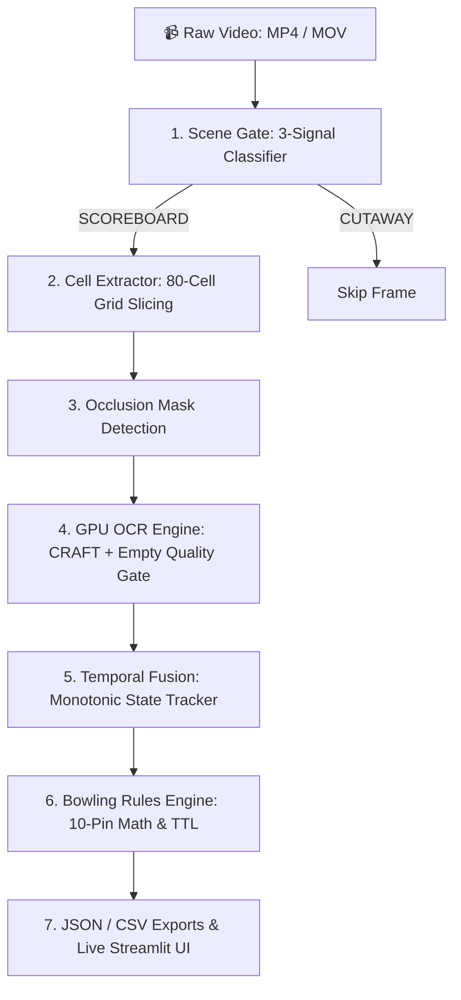

# 🎳 ScoreVision: Real-Time Bowling Scoreboard Computer Vision & OCR Extraction Engine

[](https://www.python.org/)
[](https://pytorch.org/)
[](https://opencv.org/)
[](https://streamlit.io/)
[]()

**ScoreVision** is a production-grade, end-to-end computer vision and optical character recognition (OCR) system engineered to extract, validate, and compute 10-pin regulation bowling scores in real-time from broadcast scoreboard video feeds.

---

## 🌟 Key Features

- **🎬 3-Signal Scene Gating**: Accurately differentiates between active scoreboard frames and cutaways (alley animations, logos, bowler close-ups) using temporal difference, blue HSV color density, and Canny structural edge density.
- **⚡ High-Performance GPU OCR**: Utilizes CRAFT text detection and PyTorch-accelerated recognition (NVIDIA CUDA auto-detected with seamless CPU fallback) to extract pinfall marks (`X`, `/`, `-`, `0–9`) and cumulative frame scores.
- **🚀 Empty-Cell Quality Gate**: Pre-OCR variance and contrast screening bypasses unplayed empty cells in $0.0\text{ms}$, preventing false-positive hallucinated numbers.
- **🔄 Monotonic Temporal Fusion**: Rolling-window majority voting engine with strict non-decreasing cumulative locks ($C_1 \le C_2 \le \dots \le C_{10}$), immune to transient video compression noise.
- **📐 Regulation 10-Pin Bowling Scoring Mathematics**: Full delayed lookahead scoring engine ($10 + \text{next 2}$ for strikes, $10 + \text{next 1}$ for spares, open frame reconciliation, and match running totals).
- **🎳 Authentic 1:1 Broadcast 2-Tier Scoreboard UI**: Custom Streamlit web interface matching physical alley broadcast displays (pinfall upper tier, cumulative lower tier, active bowler marquee highlight, lane badges).
- **🔬 Interactive Frame-Wise Processing Inspector**: Scrub through the match timeline frame-by-frame to inspect bounding box detections, live rule validations, and synchronous scorecard snapshots.

---

## 🏗️ Architecture & Data Flow



---

## 🚀 Quick Start Guide

### 1. Installation

Clone the repository and install the dependencies:

```bash
git clone https://github.com/baadshah697/bowling-scoreboard-extraction.git
cd bowling-scoreboard-extraction

pip install -r requirements.txt
```

### 2. Launch the Web Application (Recommended)

Start the interactive Streamlit Command Center:

```bash
streamlit run frontend/app.py
```
Open **`http://localhost:8501`** in your browser, upload your bowling match video, and click **"Run Extraction Pipeline"**.

### 3. Run via Command Line (Headless Mode)

To run the pipeline directly on any video file:

```bash
python frontend/pipeline_runner.py --video data/bowling_scoreboard.mp4 --output-dir output
```

Outputs generated in `output/`:
- `scoreboard_state.json` — Structured JSON state according to standard schema.
- `scoreboard_state.csv` — Flattened tabular CSV scorecard.
- `state_timeline.json` — Frame-by-frame parse logs and timestamps.
- `annotated_video.mp4` — Downloadable AI-annotated video with visual bounding boxes.

---

## 🧪 Automated Test Suite

ScoreVision includes a 30-case test suite covering OCR accuracy, 10-pin mathematical rules, scene gating, and pipeline streaming:

```bash
python -m pytest
```

```
============================= test session starts =============================
collected 30 items

output/debug/test_ocr.py .                                               [  3%]
tests/test_authentic_scoreboard.py ......                                [ 23%]
tests/test_ocr_accuracy.py .......                                       [ 46%]
tests/test_parser.py ..........                                          [ 80%]
tests/test_pawan_row.py .                                                [ 83%]
tests/test_pipeline_streaming.py ..                                      [ 90%]
tests/test_scene_gating.py ...                                           [100%]

============================= 30 passed in 6.82s ==============================
```

---

## 📁 Repository Structure

```
bowling-scoreboard-extraction/
├── src/
│   ├── config.py                 # Single source of truth (coordinates, bands, thresholds)
│   ├── scene_gate.py             # 3-signal frame classifier (diff, blue HSV, Canny edges)
│   ├── cell_extractor.py         # 80-cell grid slicing and quality gating
│   ├── occlusion_mask.py         # Graphic occlusion detector
│   ├── ocr_engine.py             # GPU CRAFT + PyTorch EasyOCR with empty-cell gate
│   ├── temporal_fusion.py        # Monotonic cumulative state machine
│   ├── bowling_rules.py          # Regulation 10-pin bowling calculation engine
│   ├── annotate_video.py         # Video overlay annotator
│   ├── exporter.py               # JSON, CSV, and XLSX exporter
│   └── main.py                   # Standalone CLI orchestrator
├── frontend/
│   ├── app.py                    # Streamlit web application & 2-tier broadcast dashboard
│   └── pipeline_runner.py        # Subprocess streaming worker
├── tests/
│   ├── test_authentic_scoreboard.py
│   ├── test_ocr_accuracy.py
│   ├── test_parser.py
│   ├── test_pawan_row.py
│   ├── test_pipeline_streaming.py
│   └── test_scene_gating.py
├── data/                         # Folder for input videos (.gitkeep)
├── output/                       # Folder for generated exports (.gitkeep)
├── requirements.txt              # Project dependencies
├── .gitignore                    # Git exclusion rules
└── README.md                     # Project documentation
```

---

## 👨‍💻 Author

Developed by **[baadshah697](https://github.com/baadshah697)**.
